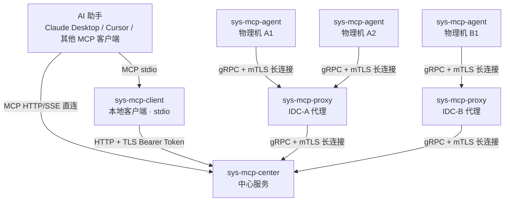

# sys-mcp 设计文档索引

## 文档列表

| 文档 | 说明 |
| ---- | ---- |
| [README.md](README.md)（本文件） | 项目概览：架构图、功能清单、MCP API 参考、安全、配置、Taskfile |
| [overview.md](overview.md) | 整体详细设计：Proto 定义、公共库接口、完整数据流、错误规范、可观测性、部署拓扑 |
| [sys-mcp-agent.md](sys-mcp-agent.md) | agent 详细设计：各采集模块、文件操作、路径访问控制、本地 API 转发 |
| [sys-mcp-proxy.md](sys-mcp-proxy.md) | proxy 详细设计：下游注册表、消息路由、多级级联、重连补注册 |
| [sys-mcp-center.md](sys-mcp-center.md) | center 详细设计：MCP 工具注册、全局注册表、请求路由、HA 设计 |
| [sys-mcp-client.md](sys-mcp-client.md) | client 详细设计：stdio↔HTTP 透传、MCP SDK 用法、与 Claude Desktop 集成 |
| [codex-architecture-review.md](codex-architecture-review.md) | 当前架构设计 review：不合理点、缺失项、修订优先级 |

---

## 一、项目简介

sys-mcp 是一个用 Go 语言编写的分布式系统资源查询平台，通过 Model Context Protocol (MCP) 为 AI 助手提供远程物理机的系统信息查询、文件操作和本地 API 调用能力。

- **四个二进制**：`sys-mcp-agent`、`sys-mcp-proxy`（可选）、`sys-mcp-center`、`sys-mcp-client`
- **monorepo 结构**，静态编译，零运行时依赖
- Go module：`github.com/jimyag/sys-mcp`

---

## 二、整体架构



> 详细数据流、通信协议选型、HA 设计、部署拓扑见 [overview.md](overview.md)。

---

## 三、核心优势

- 零依赖部署：静态编译单二进制，无需任何运行时
- 极速启动：启动 < 10ms，响应延迟 < 1ms
- 跨平台：一键编译 Linux / macOS / Windows / ARM64
- 高性能：文件搜索比 Python 快 10-20 倍，常驻内存 < 10MB
- 安全优先：默认只读，mTLS 双向认证，多层访问控制
- 标准兼容：完全遵循 MCP 协议，兼容所有 MCP 客户端

---

## 四、仓库结构

```
sys-mcp/
├── cmd/
│   ├── sys-mcp-agent/
│   ├── sys-mcp-proxy/
│   ├── sys-mcp-center/
│   └── sys-mcp-client/
├── internal/
│   ├── sys-mcp-agent/
│   │   ├── config/
│   │   ├── collector/
│   │   ├── fileops/
│   │   └── apiproxy/
│   ├── sys-mcp-proxy/
│   │   ├── config/
│   │   ├── registry/
│   │   └── tunnel/
│   ├── sys-mcp-center/
│   │   ├── config/
│   │   ├── registry/       # PostgreSQL + 内存双层
│   │   │   ├── registry.go
│   │   │   └── pg.go
│   │   ├── router/
│   │   │   ├── router.go
│   │   │   └── internal_svc.go
│   │   └── mcp/
│   └── pkg/
│       ├── stream/          # gRPC 双向流管理、重连、心跳
│       └── tlsconf/         # mTLS 证书加载
├── api/
│   └── proto/
│       └── tunnel.proto
├── deploy/
│   ├── systemd/
│   └── config/              # 配置模板
├── docs/design/
├── Taskfile.yaml
└── go.mod
```

> `sys-mcp-client` 逻辑较薄，直接放 `cmd/sys-mcp-client/` 无需 internal 目录。
> `internal/pkg/` 只放被两个及以上服务依赖的代码。

---

## 五、依赖选型

| 依赖 | 用途 |
| ---- | ---- |
| `github.com/modelcontextprotocol/go-sdk` | MCP 协议（Tier 1 官方，支持 stdio + HTTP/SSE） |
| `google.golang.org/grpc` | agent ↔ proxy ↔ center gRPC 长连接 |
| `github.com/jackc/pgx/v5/stdlib` | PostgreSQL 驱动（center HA 存储） |
| `github.com/shirou/gopsutil/v4` | 系统信息采集（跨平台 CPU/内存/磁盘/网络） |

---

## 六、功能清单

### P0 核心功能

| 功能 | 组件 | 说明 |
| ---- | ---- | ---- |
| 系统硬件信息查询 | agent | CPU、内存、磁盘、网络、OS |
| 单层目录浏览 | agent | 非递归 |
| 文件内容读取 | agent | head/tail，大文件安全 |
| 文件内容搜索 | agent | 完全对齐 grep 参数 |
| 文件元信息查询 | agent | inode/大小/权限/时间 |
| 路径存在性检查 | agent | 文件/目录类型 |
| 本地 API 转发 | agent | 仅限 localhost/127.0.0.1 |
| agent 列表查询 | center | 所有在线 agent |
| 多机批量查询 | center | target_hosts 并发路由，聚合结果 |
| MCP stdio 接入 | client | 兼容 Claude Desktop / Cursor |

### P1 重要功能

| 功能 | 组件 |
| ---- | ---- |
| 进程信息查询与排序 | agent |
| 监听端口查询 | agent |
| 集群资源汇总 | center |
| 配置文件热重载 | 全部 |

### P2 可选功能

| 功能 | 组件 | 注意 |
| ---- | ---- | ---- |
| 文件写入 | agent | 默认禁用 |
| 命令执行 | agent | 默认禁用，高风险 |
| 结构化日志解析 | agent | JSON/CSV 字段提取 |

---

## 七、MCP 工具 API 参考

所有工具调用均通过 `sys-mcp-client`（stdio）或直连 `sys-mcp-center`（HTTP/SSE）发起。

### center 专有工具

#### list_agents
列出所有在线 agent。参数：无。

```json
{
  "agents": [
    {"hostname": "server-01", "ip": "192.168.1.100", "os": "linux", "status": "online", "last_heartbeat": "2026-04-10T09:48:00Z"}
  ],
  "total": 1,
  "online": 1
}
```

### agent 工具

所有 agent 工具接受 `target_hosts`（数组，必填）。查询单台时传 1 个元素的数组即可。

**统一响应格式**（`ToolMultiResult`）：

```json
{
  "results": [
    {"host": "server-01", "data": { ...工具结果... }},
    {"host": "server-02", "error": "request timeout"}
  ],
  "total": 2,
  "success": 1,
  "failed": 1
}
```

#### 1. get_system_hardware_info

| 参数 | 类型 | 必填 |
| ---- | ---- | ---- |
| target_hosts | array\<string\> | 是 |

`data` 字段示例：
```json
{
  "cpu": {"model": "Intel i7-10700K", "cores": 8, "threads": 16, "usage_percent": 45.2},
  "memory": {"total_gb": 32.0, "used_gb": 18.5, "usage_percent": 57.8},
  "disks": [{"device": "/dev/sda1", "mount_point": "/", "total_gb": 512.0, "usage_percent": 50.0}],
  "network": {"interfaces": [{"name": "eth0", "ip_address": "192.168.1.100"}]},
  "system": {"os": "linux", "platform": "ubuntu", "kernel_version": "5.15.0", "hostname": "server-01", "uptime_seconds": 86400}
}
```

#### 2. list_directory

| 参数 | 类型 | 必填 | 默认 | 说明 |
| ---- | ---- | ---- | ---- | ---- |
| target_hosts | array\<string\> | 是 | - | |
| path | string | 是 | - | 目录路径 |
| show_hidden | bool | 否 | false | |
| show_details | bool | 否 | true | 大小/时间/权限 |

`data` 字段示例：
```json
{
  "path": "/var/log",
  "items": [
    {"name": "syslog", "type": "file", "size": 10485760, "modified_at": "2026-04-10T12:34:56Z", "permissions": "-rw-r--r--"}
  ]
}
```

#### 3. read_file

| 参数 | 类型 | 必填 | 默认 | 说明 |
| ---- | ---- | ---- | ---- | ---- |
| target_hosts | array\<string\> | 是 | - | |
| path | string | 是 | - | |
| encoding | string | 否 | utf-8 | utf-8/gbk/gb2312 |
| head | int | 否 | 0 | 前 N 行 |
| tail | int | 否 | 0 | 后 N 行 |
| max_lines | int | 否 | 1000 | 上限 |

`data` 字段示例：
```json
{"path": "/var/log/syslog", "total_lines": 15000, "returned_lines": 1000, "is_truncated": true, "content": ["..."]}
```

#### 4. search_file_content

| 参数 | grep 对应 | 必填 | 默认 | 说明 |
| ---- | --------- | ---- | ---- | ---- |
| target_hosts | - | 是 | - | |
| pattern | PATTERN | 是 | - | 字符串或正则 |
| path | FILE | 是 | - | |
| i | -i | 否 | false | 忽略大小写 |
| v | -v | 否 | false | 反向匹配 |
| n | -n | 否 | true | 显示行号 |
| c | -c | 否 | false | 只显示计数 |
| A | -A | 否 | 0 | 后 N 行上下文 |
| B | -B | 否 | 0 | 前 N 行上下文 |
| C | -C | 否 | 0 | 前后 N 行 |
| E | -E | 否 | true | 扩展正则 |
| F | -F | 否 | false | 固定字符串 |
| m | -m | 否 | 0 | 最多匹配 N 行 |
| max_line_length | - | 否 | 10000 | 跳过超长行 |

`data` 字段示例：
```json
{
  "file": "/var/log/nginx/access.log",
  "total_lines_processed": 25000,
  "matched_lines_count": 42,
  "matches": [{"line_number": 1024, "content": "...", "is_match": true}]
}
```

#### 5. proxy_local_api

| 参数 | 类型 | 必填 | 默认 | 说明 |
| ---- | ---- | ---- | ---- | ---- |
| target_hosts | array\<string\> | 是 | - | |
| method | string | 是 | - | GET/POST/PUT/DELETE/PATCH |
| path | string | 是 | - | 如 /api/v1/metrics |
| port | int | 否 | 80 | |
| use_https | bool | 否 | false | |
| headers | map\<string,string\> | 否 | {} | |
| body | string | 否 | "" | |
| timeout | int | 否 | 30 | 秒 |

`data` 字段示例：
```json
{"request_url": "http://127.0.0.1:9090/api/v1/metrics", "status_code": 200, "body": "...", "duration_ms": 15}
```

#### 6. stat_file

| 参数 | 类型 | 必填 |
| ---- | ---- | ---- |
| target_hosts | array\<string\> | 是 |
| path | string | 是 |

`data` 字段示例：
```json
{"path": "/var/log/syslog", "exists": true, "type": "file", "size": 10485760, "permissions": "-rw-r--r--", "owner": "syslog", "mtime": "2026-04-10T09:48:00Z"}
```

#### 7. check_path_exists

| 参数 | 类型 | 必填 |
| ---- | ---- | ---- |
| target_hosts | array\<string\> | 是 |
| path | string | 是 |

`data` 字段示例：
```json
{"path": "/var/log/nginx", "exists": true, "type": "dir"}
```

---

## 八、安全设计

| 控制点 | 策略 |
| ------ | ---- |
| 默认只读 | 写入/执行功能默认禁用，需配置文件显式开启 |
| 目录访问控制 | 白名单 + 黑名单（/etc /root /proc /sys 等默认禁止） |
| 文件大小限制 | 默认 100MB，超限拒绝读取 |
| 本地 API | 强制只能访问 localhost/127.0.0.1，禁止外部 IP |
| 端口控制 | 特权端口（<1024）默认禁止，支持白名单 |
| 双向认证 | mTLS（gRPC 链路）+ Bearer Token（HTTP 链路）|
| 审计日志 | 记录所有 MCP 工具调用（时间/工具/参数/来源 IP/结果）|

---

## 九、配置文件

### sys-mcp-agent（~/.config/sys-mcp-agent/config.yaml）

```yaml
upstream:
  address: "proxy-idc-a.example.com:9443"
  token: "agent-secret-token"
  reconnect_max_delay_sec: 5
  tls:
    cert_file: ~/.config/sys-mcp-agent/agent.crt
    key_file:  ~/.config/sys-mcp-agent/agent.key
    ca_file:   ~/.config/sys-mcp-agent/ca.crt

security:
  allowed_directories: [/home, /var/log]
  blocked_directories: [/etc, /root]
  max_file_size_mb: 100
  allow_privileged_ports: false
  allowed_ports: [8080, 9090, 3000]

logging:
  log_requests: true
  log_file: ~/.config/sys-mcp-agent/agent.log
```

### sys-mcp-proxy（~/.config/sys-mcp-proxy/config.yaml）

```yaml
hostname: "proxy-idc-a"

listen:
  grpc_address: "0.0.0.0:9443"
  tls:
    cert_file: ~/.config/sys-mcp-proxy/proxy.crt
    key_file:  ~/.config/sys-mcp-proxy/proxy.key
    ca_file:   ~/.config/sys-mcp-proxy/ca.crt

upstream:
  address: "center.example.com:9443"
  token: "proxy-secret-token"
  reconnect_max_delay_sec: 5
  tls:
    cert_file: ~/.config/sys-mcp-proxy/proxy.crt
    key_file:  ~/.config/sys-mcp-proxy/proxy.key
    ca_file:   ~/.config/sys-mcp-proxy/ca.crt

logging:
  log_requests: true
  log_file: ~/.config/sys-mcp-proxy/proxy.log
```

### sys-mcp-center（~/.config/sys-mcp-center/config.yaml）

```yaml
instance_id: "center-01"

listen:
  http_address:          "0.0.0.0:8443"
  grpc_address:          "0.0.0.0:9443"
  internal_grpc_address: "0.0.0.0:9444"
  tls:
    cert_file: ~/.config/sys-mcp-center/center.crt
    key_file:  ~/.config/sys-mcp-center/center.key
    ca_file:   ~/.config/sys-mcp-center/ca.crt

postgres:
  dsn: "postgres://sysmcp:password@pg:5432/sysmcp?sslmode=require"

auth:
  client_tokens: ["user-api-token-1"]
  agent_tokens:  ["agent-secret-token", "proxy-secret-token"]

router:
  request_timeout_sec: 5

logging:
  log_requests: true
  log_file: ~/.config/sys-mcp-center/center.log
```

### sys-mcp-client（~/.config/sys-mcp-client/config.yaml）

```yaml
center:
  address: "center.example.com:8443"
  token: "user-api-token-1"
  tls:
    ca_file: ~/.config/sys-mcp-client/ca.crt

logging:
  log_file: ~/.config/sys-mcp-client/client.log
```

---

## 十、构建与开发（Taskfile）

项目使用 [Task](https://taskfile.dev) 管理构建任务（`brew install go-task`）。

```yaml
# Taskfile.yaml
version: "3"

vars:
  AGENT_PKG:  ./cmd/sys-mcp-agent
  PROXY_PKG:  ./cmd/sys-mcp-proxy
  CENTER_PKG: ./cmd/sys-mcp-center
  CLIENT_PKG: ./cmd/sys-mcp-client
  BIN_DIR:    bin

tasks:
  default:
    desc: "列出所有可用任务"
    cmds: [task --list]

  build:
    desc: "编译四个二进制到 bin/"
    cmds:
      - go build -o {{.BIN_DIR}}/sys-mcp-agent  {{.AGENT_PKG}}
      - go build -o {{.BIN_DIR}}/sys-mcp-proxy  {{.PROXY_PKG}}
      - go build -o {{.BIN_DIR}}/sys-mcp-center {{.CENTER_PKG}}
      - go build -o {{.BIN_DIR}}/sys-mcp-client {{.CLIENT_PKG}}

  build:agent:
    cmds: [go build -o {{.BIN_DIR}}/sys-mcp-agent {{.AGENT_PKG}}]

  build:proxy:
    cmds: [go build -o {{.BIN_DIR}}/sys-mcp-proxy {{.PROXY_PKG}}]

  build:center:
    cmds: [go build -o {{.BIN_DIR}}/sys-mcp-center {{.CENTER_PKG}}]

  build:client:
    cmds: [go build -o {{.BIN_DIR}}/sys-mcp-client {{.CLIENT_PKG}}]

  cross-build:
    desc: "交叉编译 agent/proxy 到 linux/amd64 和 linux/arm64"
    cmds:
      - GOOS=linux GOARCH=amd64 go build -o {{.BIN_DIR}}/sys-mcp-agent-linux-amd64 {{.AGENT_PKG}}
      - GOOS=linux GOARCH=arm64 go build -o {{.BIN_DIR}}/sys-mcp-agent-linux-arm64 {{.AGENT_PKG}}
      - GOOS=linux GOARCH=amd64 go build -o {{.BIN_DIR}}/sys-mcp-proxy-linux-amd64 {{.PROXY_PKG}}
      - GOOS=linux GOARCH=arm64 go build -o {{.BIN_DIR}}/sys-mcp-proxy-linux-arm64 {{.PROXY_PKG}}

  proto:
    desc: "从 api/proto/*.proto 生成 gRPC 代码"
    cmds:
      - protoc --go_out=. --go-grpc_out=. api/proto/tunnel.proto

  test:
    desc: "运行所有测试"
    cmds: [go test ./...]

  test:race:
    desc: "运行测试（开启竞态检测）"
    cmds: [go test -race ./...]

  lint:
    desc: "运行 golangci-lint"
    cmds: [golangci-lint run ./...]

  clean:
    cmds: [rm -rf {{.BIN_DIR}}]

  deps:
    cmds: [go mod download, go mod tidy]
```
