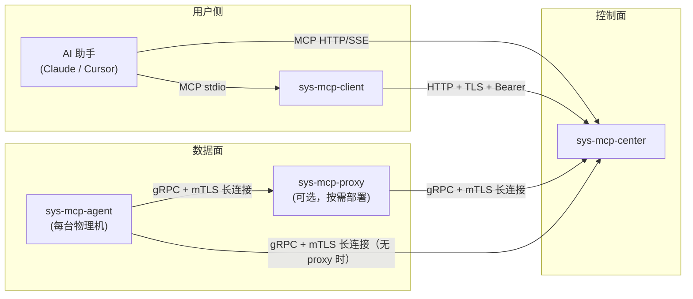
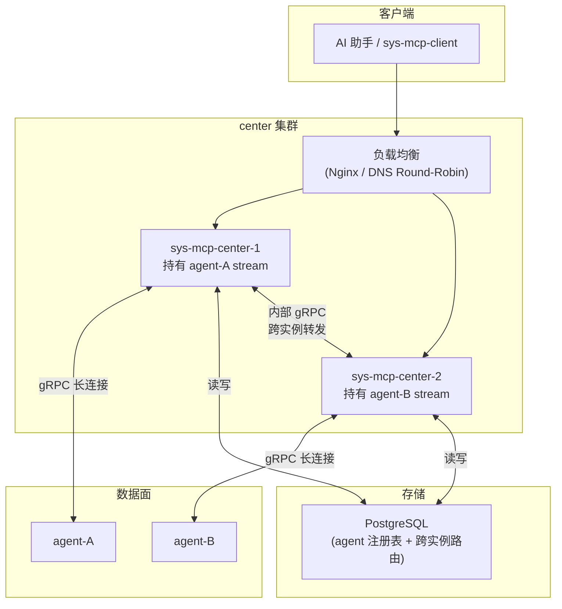
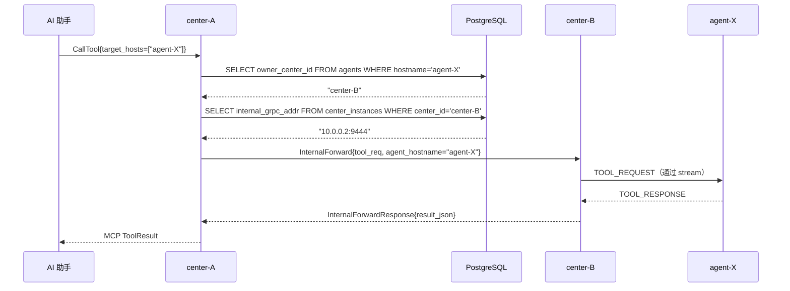
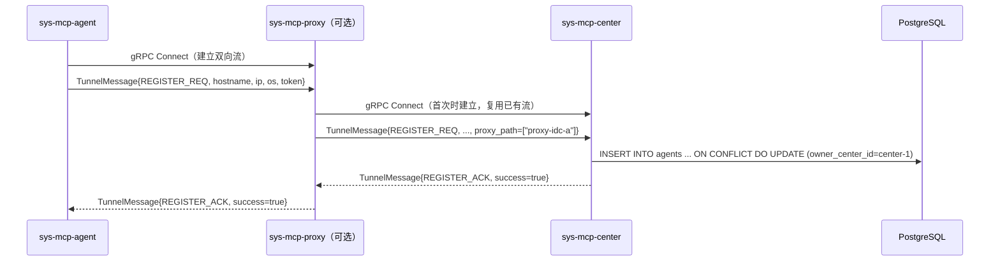
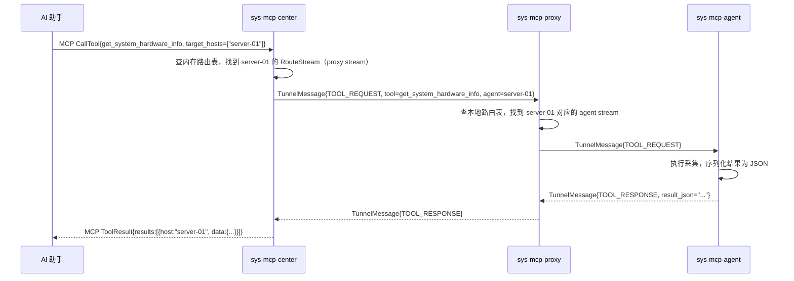
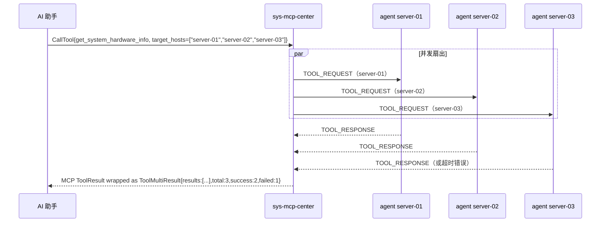
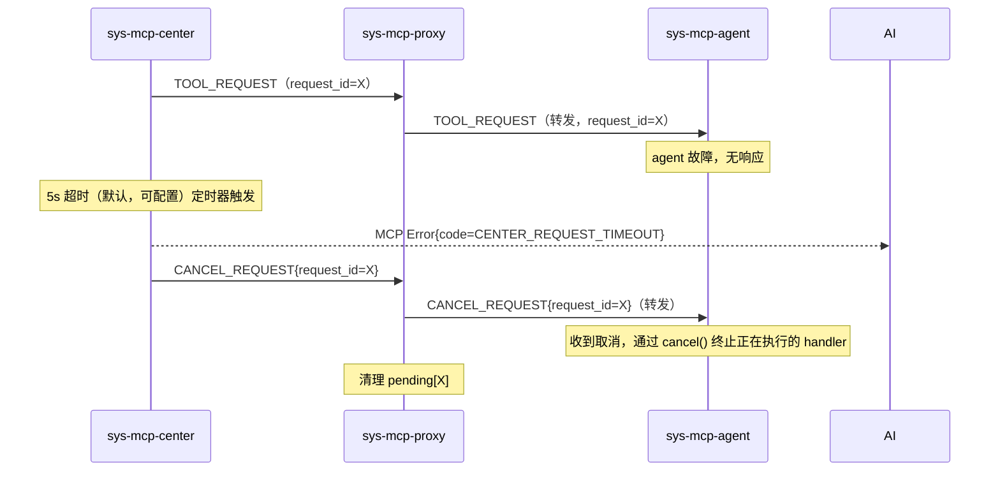

# sys-mcp 整体详细设计

## 目录

1. [项目定位与目标](#一项目定位与目标)
2. [系统边界与约束](#二系统边界与约束)
3. [整体架构](#三整体架构)
4. [center 高可用设计](#四-center-高可用设计)
5. [Proto 接口定义](#五-proto-接口定义)
6. [公共库设计（internal/pkg）](#六公共库设计internalpkg)
7. [完整数据流](#七完整数据流)
8. [错误处理规范](#八错误处理规范)
9. [可观测性](#九可观测性)
10. [部署拓扑](#十部署拓扑)
11. [版本兼容策略](#十一版本兼容策略)

---

## 一、项目定位与目标

sys-mcp 是一个用 Go 编写的分布式系统资源查询平台，通过 Model Context Protocol (MCP) 向 AI 助手暴露远程物理机的系统信息查询、文件操作和本地 API 调用能力。

目标：
- 零依赖部署，单二进制静态编译
- 支持数万台物理机的大规模部署（通过 proxy 分层聚合）
- AI 助手无感知架构（只需知道 MCP 工具名和参数）
- 最小权限原则，默认只读，安全优先

不在范围内：
- 配置管理、软件分发（不是 Ansible / Salt）
- 实时流式监控大盘（不是 Prometheus / Grafana）
- 命令执行平台（不是 Fabric / Capistrano）

---

## 二、系统边界与约束



关键约束：
- center 是唯一的 MCP 服务端，所有 MCP 工具调用都经过 center
- center 支持多实例高可用部署，共享 PostgreSQL 存储 agent 注册信息
- agent / proxy 只对 center / proxy 方向主动建连，不对外暴露端口（防火墙友好）
- proxy 是纯透明转发层，不解析业务语义，不缓存结果，不持久化数据
- proxy 与 center 暴露完全相同的 gRPC 注册接口（`TunnelService`），agent 无需感知上游是 proxy 还是 center
- center 维护完整的 agent 注册表（持久化到 PostgreSQL），proxy 只维护本地内存中的实时路由表

---

## 三、整体架构

### 组件职责一览

| 组件           | 部署位置   | 暴露端口                          | 主动连接方向                       |
| -------------- | ---------- | --------------------------------- | ---------------------------------- |
| sys-mcp-agent  | 每台物理机 | 无                                | → proxy 或 center（gRPC）          |
| sys-mcp-proxy  | IDC / 机房 | grpc_address（下游，同 center 接口） | → center 或上级 proxy（gRPC）   |
| sys-mcp-center | 中心机房   | http_address + grpc_address       | 被动接受；HA 实例间通过 PostgreSQL 协调 |
| sys-mcp-client | 用户本地   | 无                                | → center（HTTP）                   |

### 核心数据结构：AgentRecord

center PostgreSQL 注册表中每条 agent 记录（同时在内存中缓存路由信息）：

```go
type AgentRecord struct {
    Hostname      string
    IP            string
    OS            string
    AgentVersion  string
    RegisteredAt  time.Time
    LastHeartbeat time.Time
    Status        AgentStatus  // Online / Offline

    // 路由信息（仅内存，不写 DB）
    // 直连时 RouteStream 是 agent 自身的 stream
    // 经过 proxy 时 RouteStream 是离 center 最近的 proxy stream
    RouteStream    TunnelStream  `db:"-"`
    OwnerCenterID  string        // 哪个 center 实例持有该 stream（写 DB）
    ProxyPath      []string      // 经过的 proxy hostname 列表，直连时为空
}
```

---

## 四、center 高可用设计

### 4.1 架构概述

center 支持多实例水平扩展，所有实例通过 PostgreSQL 共享 agent 注册信息，实现高可用和请求路由。



### 4.2 PostgreSQL 数据模型

```sql
-- agent 注册信息（Last-Write-Wins，重复注册直接 UPSERT）
CREATE TABLE agents (
    hostname          TEXT PRIMARY KEY,
    ip                TEXT        NOT NULL,
    os                TEXT        NOT NULL,
    agent_version     TEXT        NOT NULL,
    registered_at     TIMESTAMPTZ NOT NULL DEFAULT NOW(),
    last_heartbeat    TIMESTAMPTZ NOT NULL DEFAULT NOW(),
    status            TEXT        NOT NULL DEFAULT 'online',  -- online / offline
    owner_center_id   TEXT        NOT NULL,
    proxy_path        TEXT[]      NOT NULL DEFAULT '{}',
    node_type         TEXT        NOT NULL DEFAULT 'agent'    -- 'agent' / 'proxy'
);
CREATE INDEX idx_agents_status    ON agents(status);
CREATE INDEX idx_agents_node_type ON agents(node_type);

-- center 实例注册（跨实例路由发现，定期 UPSERT 续约）
CREATE TABLE center_instances (
    center_id           TEXT PRIMARY KEY,
    internal_grpc_addr  TEXT        NOT NULL,
    last_heartbeat      TIMESTAMPTZ NOT NULL DEFAULT NOW()
);
```

- **agents**：所有 center 实例共写，`owner_center_id` 标识持有 stream 的实例；`node_type='proxy'` 的行代表 proxy 自身注册，`list_agents` **只返回** `node_type='agent'` 的记录，防止 proxy hostname 污染 AI 调用面
- **center_instances**：每个 center 实例每 10s UPSERT 一次，60s 无更新视为失效
- 心跳：agent 每次发送心跳时 UPDATE `last_heartbeat`；center offline checker 定期将超时的 agent 置为 offline

### 4.3 跨实例请求路由

当 center-A 收到对 agent-X 的工具调用请求，但 agent-X 的 stream 在 center-B 上时：



### 4.4 center 实例内部通信

center 额外暴露一个内部 gRPC 端口（`internal_grpc_address`），仅集群内互通，不对外：

```protobuf
service CenterInternalService {
  rpc ForwardTool(ForwardToolRequest) returns (ForwardToolResponse);
}

message ForwardToolRequest {
  string request_id     = 1;
  string agent_hostname = 2;
  string tool_name      = 3;
  string params_json    = 4;
}

message ForwardToolResponse {
  string result_json    = 1;
  bool   is_error       = 2;
  string agent_hostname = 3;  // 批量转发时用于将结果映射回具体 host
}
```

### 4.5 重复注册处理

同一 agent 可能因重启、网络抖动、或同时连接多个 center 实例而多次注册。处理策略：

- **最后写入胜（Last-Write-Wins）**：以最新的 `RegisterRequest` UPSERT PostgreSQL 中的记录
- 旧 center 实例检测到该 agent 已被新实例接管（`owner_center_id` 变更）后，主动关闭旧 stream
- agent 的注册幂等，重复注册不产生副作用

**stream_generation 防幽灵路由**：为防止两个 center 同时认为自己持有同一 agent 的 stream（split-brain），agents 表增加 `stream_generation BIGINT NOT NULL DEFAULT 0`，每次 UPSERT 时 `generation = generation + 1`。所有发往 agent 的消息（`ToolRequest`、`CancelRequest`）均携带当前 generation；agent 若收到 generation 不匹配的消息直接丢弃，中心也仅接受匹配 generation 的响应。旧 center 实例在执行任何 stream 操作前先校验 PG 中的 generation，不匹配则终止操作。

```sql
-- 在 agents 表中增加
stream_generation  BIGINT      NOT NULL DEFAULT 0
-- UPSERT 时：stream_generation = agents.stream_generation + 1
```

### 4.6 PostgreSQL 降级策略

| 场景 | 行为 |
| ---- | ---- |
| 启动时 PG 不可达 | 指数退避重试（最多 30s），超时后 fatal 退出，打印明确错误信息 |
| 运行中 PG 断开 | 读操作（`list_agents` 等）返回 `CENTER_PG_UNAVAILABLE` 错误；已建立的 stream 内存路由**继续可用**（仅依赖内存路由表）；写操作（心跳更新、新注册）带重试，失败后打印 error 日志 |
| PG 恢复后 | 自动重连，心跳/注册写操作恢复正常；内存与 PG 之间的短暂不一致在下次心跳或注册时自愈 |

### 4.7 Schema 迁移策略

使用 [`pressly/goose`](https://github.com/pressly/goose) 管理 schema 版本：

- 迁移文件存放在 `deploy/migrations/`，格式 `YYYYMMDDHHMMSS_description.sql`
- center 启动时自动执行 `goose.Up()`，利用 goose 内置的 PostgreSQL advisory lock 保证多实例并发启动只有一个执行 DDL
- 版本字段写入 PG `goose_db_version` 表，滚动升级时旧实例不受新字段影响（proto3 及 Go struct 均向后兼容新增字段）

---

## 五、Proto 接口定义

### api/proto/tunnel.proto

所有 gRPC 双向流消息均封装在 `TunnelMessage` 中，通过 `type` 字段区分。**proxy 和 center 暴露完全相同的 `TunnelService`，agent 无需感知上游类型。**

```protobuf
syntax = "proto3";
package tunnel;
option go_package = "github.com/jimyag/sysplane/api/proto/tunnel";

// 双向流服务：agent/proxy 调用 Connect 建立长连接
// proxy 和 center 均实现此接口（接口完全相同）
service TunnelService {
  rpc Connect(stream TunnelMessage) returns (stream TunnelMessage);
}

message TunnelMessage {
  string request_id = 1;  // 每条消息唯一 ID，用于请求/响应配对
  MessageType type  = 2;

  oneof payload {
    RegisterRequest       register_req       = 10;
    RegisterAck           register_ack       = 11;
    BatchRegisterRequest  batch_register_req = 12;  // 批量注册（proxy 重连后补注册用）
    Heartbeat             heartbeat          = 13;
    HeartbeatAck          heartbeat_ack      = 14;
    ToolRequest           tool_req           = 15;
    ToolResponse          tool_resp          = 16;
    ErrorResponse         error_resp         = 17;
    BatchRegisterAck      batch_register_ack = 18;  // 批量注册确认
    CancelRequest         cancel_req         = 19;  // 取消进行中的请求
  }
}

enum MessageType {
  MESSAGE_TYPE_UNSPECIFIED = 0;
  REGISTER_REQ             = 1;
  REGISTER_ACK             = 2;
  BATCH_REGISTER_REQ       = 3;  // 批量注册
  HEARTBEAT                = 4;
  HEARTBEAT_ACK            = 5;
  TOOL_REQUEST             = 6;
  TOOL_RESPONSE            = 7;
  ERROR_RESPONSE           = 8;
  BATCH_REGISTER_ACK       = 9;  // 批量注册确认
  CANCEL_REQUEST           = 10; // 取消请求（center 超时后通知 agent 停止执行）
}

// 节点类型：agent 可执行工具，proxy 只转发
enum NodeType {
  NODE_TYPE_AGENT = 0;
  NODE_TYPE_PROXY = 1;
}

message RegisterRequest {
  string hostname      = 1;
  string ip            = 2;
  string os            = 3;
  string agent_version = 4;
  string token         = 5;  // 预共享 token，center/proxy 用于验证合法性
  repeated string proxy_path = 6;  // proxy 在透传时追加自身 hostname
  NodeType node_type   = 7;  // 节点类型；proxy 注册时设置为 NODE_TYPE_PROXY
}

// 批量注册：proxy 在重连后将所有下游 agent 一次性补注册，减少消息往返
message BatchRegisterRequest {
  repeated RegisterRequest agents = 1;
}

message RegisterAck {
  bool   success  = 1;
  string message  = 2;
  string hostname = 3;  // 与注册请求对应，proxy 收到时路由回正确下游
}

// 批量注册确认：与 BATCH_REGISTER_REQ 对应，每个 agent 单独一条结果
// 语义：逐项处理，不保证原子性；失败项可单独重试
message BatchRegisterAck {
  repeated RegisterAck results = 1;
}

message Heartbeat {
  string agent_hostname = 1;
  int64  timestamp      = 2;  // Unix 毫秒
}

message HeartbeatAck {
  int64  timestamp      = 1;
  string agent_hostname = 2;  // proxy 用于路由 ACK 回正确下游 stream
}

// 取消进行中的请求：center 超时（或 AI 连接断开）后发出，agent/proxy 及时停止执行
message CancelRequest {
  string request_id       = 1;
  int64  stream_generation = 2;  // agent 校验 generation，不匹配则忽略
}

// center 下发到 agent 的工具调用请求
message ToolRequest {
  string tool_name         = 1;
  string params_json       = 2;  // JSON 序列化的参数，避免 proto 与 MCP 参数结构耦合
  string agent_hostname    = 3;  // 目标 agent（proxy 用于路由到正确 agent）
  int64  stream_generation = 4;  // 防幽灵路由：agent 校验 generation，旧 center 发来的消息会被丢弃
}

// agent 返回给 center 的执行结果
message ToolResponse {
  string result_json       = 1;  // JSON 序列化的结果
  bool   is_error          = 2;
  int64  stream_generation = 3;  // center 校验 generation，不匹配则丢弃（防旧 stream 响应污染）
}

message ErrorResponse {
  string code    = 1;
  string message = 2;
}
```

### 请求 ID 规范

- 格式：`<center_node_id>-<unix_ms>-<seq>` 例如 `center01-1712750400000-0042`
- center 生成，全链路透传，用于日志关联和超时追踪
- proxy 不修改 request_id，只转发

---

## 六、公共库设计（internal/pkg）

### internal/pkg/stream — 双向流管理

所有需要维护 gRPC 双向流的组件（agent、proxy、center）都依赖此包。

```go
// StreamConn 封装一条 gRPC 双向流，提供发送、接收、心跳、重连能力
type StreamConn struct {
    // 内部字段省略
}

// NewDialer 创建一个出向连接器（agent/proxy 使用）
// 建立连接后自动发送 RegisterRequest，并维持心跳
func NewDialer(cfg DialerConfig) *Dialer

type DialerConfig struct {
    Endpoint           string
    TLS                *tls.Config
    RegisterMsg        *tunnel.RegisterRequest
    HeartbeatInterval  time.Duration  // 默认 30s
    ReconnectMaxDelay  time.Duration  // 默认 5s（可配置）
    OnMessage          func(msg *tunnel.TunnelMessage)  // 收到消息的回调
}

// NewListener 创建一个入向连接监听器（center/proxy 使用）
// 每个新的 stream 连接触发 OnConnect 回调
func NewListener(cfg ListenerConfig) *Listener

type ListenerConfig struct {
    OnConnect    func(stream TunnelStream)
    OnDisconnect func(stream TunnelStream, err error)
    HeartbeatTimeout time.Duration  // 默认 90s，超时则标记 offline
}

// TunnelStream 代表一条已建立的 gRPC 双向流（入向，center/proxy 侧）
type TunnelStream interface {
    Send(*tunnel.TunnelMessage) error
    RemoteAddr() string
    Context() context.Context
    Close()
}
```

#### 重连策略

采用指数退避，上限 `ReconnectMaxDelay`（默认 **5s**，可配置）：

```
延迟 = min(初始延迟 × 2^重试次数, 最大延迟) + 随机抖动(0~200ms)
```

- 初始延迟：200ms
- 最大延迟：5s（默认，可配置）
- 每次成功连接后重置计数器
- 设计原则：快速恢复，避免 agent 长时间不可查询；如需更保守的重连间隔可在配置中调大

#### 心跳

- agent/proxy 每 30s 发送 `Heartbeat`
- center/proxy 收到 `Heartbeat` 后立即回 `HeartbeatAck` 并更新 `LastHeartbeat`
- center/proxy 侧：若超过 `HeartbeatTimeout`（默认 90s）未收到心跳，将对应 agent 标记为 Offline

### internal/pkg/tlsconf — mTLS 配置加载

```go
// LoadServerTLS 加载服务端 TLS 配置（要求客户端提供证书）
func LoadServerTLS(certFile, keyFile, caFile string) (*tls.Config, error)

// LoadClientTLS 加载客户端 TLS 配置（提供客户端证书给服务端验证）
func LoadClientTLS(certFile, keyFile, caFile string) (*tls.Config, error)
```

---

## 七、完整数据流

### 7.1 agent 启动注册



### 7.2 AI 发起工具调用（经 proxy，多机）



### 7.3 AI 发起多机并发查询

center 对多目标 agent 并发扇出，所有结果聚合后一次性返回：



- 所有 agent 工具均只接受 `target_hosts`（数组），不提供单台 `target_host` 参数
- 多机查询超时遵循 `request_timeout_sec` 配置；单台超时不影响其他机器的结果
- 返回格式：`ToolMultiResult` 包装对象（非裸数组），便于后续扩展字段

### 7.4 请求超时与取消传播



超时默认值：**5s**，可通过 center 配置 `request_timeout_sec` 调整。

- center 超时向 AI 返回错误后，立即通过 stream 向 agent（经 proxy）发送 `CANCEL_REQUEST`
- proxy 转发 `CANCEL_REQUEST` 并清理 `pending[request_id]`
- agent 在 `dispatch` 中使用可取消 context，收到取消消息后调用 `cancel()` 终止 handler
- agent 本地工具执行超时设置为 `tool_timeout_sec`（默认与 center `request_timeout_sec` 保持一致，建议略小以预留网络时间）

---

## 八、错误处理规范

### 错误码

所有 `ErrorResponse.code` 使用字符串，格式 `COMPONENT_REASON`：

| 错误码                   | 含义                           |
| ------------------------ | ------------------------------ |
| `CENTER_AGENT_NOT_FOUND` | 目标 agent 不存在或不在线      |
| `CENTER_REQUEST_TIMEOUT` | 等待 agent 响应超时            |
| `CENTER_AUTH_FAILED`     | Bearer Token 验证失败          |
| `CENTER_PG_UNAVAILABLE`  | PostgreSQL 不可达（降级模式）  |
| `AGENT_PATH_DENIED`      | 请求路径不在白名单或在黑名单   |
| `AGENT_FILE_TOO_LARGE`   | 文件超过大小限制               |
| `AGENT_EXEC_DISABLED`    | 请求的操作未在配置中启用       |
| `PROXY_UPSTREAM_LOST`    | proxy 与上游的流断开（重连中） |
| `PROXY_AGENT_NOT_FOUND`  | proxy 本地注册表中无目标 agent |

### MCP 层错误映射

center 将内部错误映射为 MCP `isError=true` 的 ToolResult，不向调用方暴露内部 panic 或 stack trace。

---

## 九、可观测性

### 日志

所有组件使用结构化 JSON 日志（`log/slog` 标准库），字段规范：

```json
{
  "time":       "2026-04-10T10:23:40.661Z",
  "level":      "INFO",
  "component":  "sys-mcp-center",
  "request_id": "center01-1712750400000-0042",
  "agent":      "server-01",
  "tool":       "get_system_hardware_info",
  "duration_ms": 15,
  "msg":        "tool call completed"
}
```

### 指标（P1）

预留 Prometheus metrics 端点（`/metrics`），关键指标：

| 指标名                           | 类型      | 说明                    |
| -------------------------------- | --------- | ----------------------- |
| `sysmcp_agents_online`           | Gauge     | 当前在线 agent 数       |
| `sysmcp_tool_calls_total`        | Counter   | 工具调用次数（按 tool） |
| `sysmcp_tool_call_duration_ms`   | Histogram | 工具调用端到端延迟      |
| `sysmcp_tunnel_reconnects_total` | Counter   | 流重连次数（按组件）    |

---

## 十、部署拓扑

### 最小化部署（< 100 台）

```
center（1 台，无 HA）+ PostgreSQL（本机或单独实例）
  └── agent × N（直连，无 proxy）
```

### 标准 HA 部署（100 ~ 5000 台）

```
PostgreSQL（主从或托管服务）
  ↕
center × 2（负载均衡，互为主备）
  ├── proxy-idc-a → agent × N
  ├── proxy-idc-b → agent × N
  └── proxy-idc-c → agent × N
```

### 大规模 HA 部署（5000 台以上）

```
PostgreSQL（主从或托管服务）
  ↕
center × 3+（负载均衡）
  ├── proxy-region-north
  │     ├── proxy-idc-a1 → agent × N
  │     └── proxy-idc-a2 → agent × N
  └── proxy-region-south
        └── proxy-idc-b1 → agent × N
```

### 证书规划

所有 gRPC 链路使用同一 CA 签发的证书，证书分配：

| 组件   | 证书用途                                                |
| ------ | ------------------------------------------------------- |
| CA     | 根证书，仅用于签发，不部署在任何组件                    |
| center | 服务端证书（`center.crt`）                              |
| proxy  | 双向：对上游作为客户端，对下游作为服务端（`proxy.crt`） |
| agent  | 客户端证书（`agent.crt`），每台机器可单独签发           |

---

## 十一、版本兼容策略

- proto 文件使用 `proto3`，新增字段向后兼容，删除字段需升级主版本
- center 与 agent 之间允许小版本差异（center 新 / agent 旧），不允许 agent 比 center 新
- `RegisterRequest` 中包含 `agent_version`，center 可在注册时拒绝过旧的 agent 版本
- MCP 工具参数变更遵循 MCP 规范的向后兼容原则（新增可选参数，不删除已有参数）
