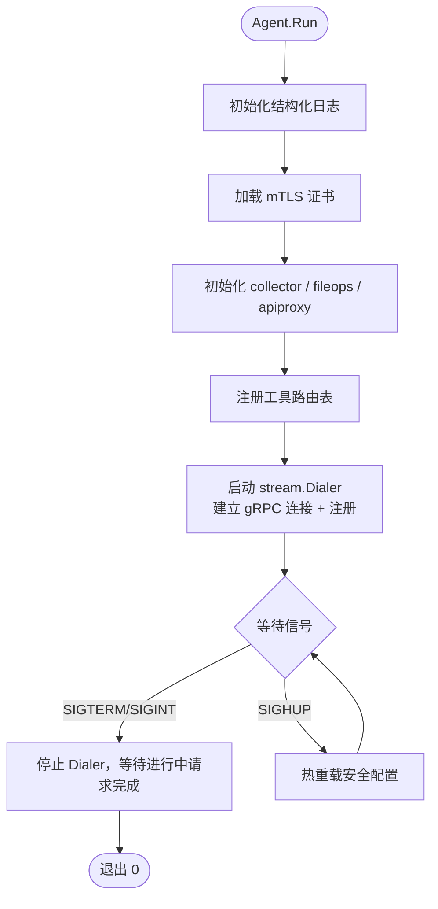

# sys-mcp-agent 详细设计

## 目录

1. [职责与边界](#一职责与边界)
2. [目录结构](#二目录结构)
3. [配置设计](#三配置设计)
4. [模块设计](#四模块设计)
5. [与上游通信](#五与上游通信)
6. [工具实现细节](#六工具实现细节)
7. [启动与关闭流程](#七启动与关闭流程)
8. [安全控制](#八安全控制)
9. [测试策略](#九测试策略)

---

## 一、职责与边界

sys-mcp-agent 是部署在每台物理机上的常驻进程，职责：

- 采集本机系统信息（CPU、内存、磁盘、网络）
- 提供文件系统访问（目录浏览、文件读取、内容搜索、元信息查询）
- 转发本地 HTTP API 调用（proxy_local_api）
- 维持与上游（proxy 或 center）的 gRPC 长连接，处理下发的工具请求

不在 agent 职责范围内：
- 不向外暴露任何 TCP 端口（防火墙友好）
- 不存储任何状态（无数据库、无持久化）
- 不了解 MCP 协议（只处理 `ToolRequest` / `ToolResponse` 内的 JSON）

---

## 二、目录结构

```
internal/sys-mcp-agent/
├── config/
│   └── config.go          # AgentConfig 结构体 + 加载逻辑
├── collector/
│   ├── hardware.go        # get_system_hardware_info
│   ├── process.go         # get_process_list（P1）
│   ├── port.go            # get_open_ports（P1）
│   └── collector.go       # Collector 接口 + 工厂函数
├── fileops/
│   ├── listdir.go         # list_directory
│   ├── readfile.go        # read_file
│   ├── search.go          # search_file_content
│   ├── stat.go            # stat_file + check_path_exists
│   ├── guard.go           # 路径访问控制（白名单/黑名单）
│   └── fileops.go         # FileOps 接口 + 工厂函数
├── apiproxy/
│   ├── proxy.go           # proxy_local_api 实现
│   └── guard.go           # 端口访问控制
└── agent.go               # Agent 主结构体，组装各模块，处理 ToolRequest 分发
```

---

## 三、配置设计

```go
// internal/sys-mcp-agent/config/config.go

package config

import (
    "os"
    "gopkg.in/yaml.v3"
)

type AgentConfig struct {
    Upstream       UpstreamConfig  `yaml:"upstream"`
    Security       SecurityConfig  `yaml:"security"`
    Logging        LoggingConfig   `yaml:"logging"`
    ToolTimeoutSec int             `yaml:"tool_timeout_sec"` // 工具执行超时（默认 4，应略小于 center request_timeout_sec）
}

type UpstreamConfig struct {
    Address              string    `yaml:"address"`               // proxy 或 center 地址
    Token                string    `yaml:"token"`                 // 预共享注册 token
    ReconnectMaxDelaySec int       `yaml:"reconnect_max_delay_sec"` // 默认 5
    TLS                  TLSConfig `yaml:"tls"`
}

type TLSConfig struct {
    CertFile string `yaml:"cert_file"`
    KeyFile  string `yaml:"key_file"`
    CAFile   string `yaml:"ca_file"`
}

type SecurityConfig struct {
    AllowedDirectories  []string `yaml:"allowed_directories"`
    BlockedDirectories  []string `yaml:"blocked_directories"`
    MaxFileSizeMB       int      `yaml:"max_file_size_mb"`      // 默认 100
    AllowPrivilegedPorts bool    `yaml:"allow_privileged_ports"` // 默认 false
    AllowedPorts        []int    `yaml:"allowed_ports"`
    AllowFileWrite      bool     `yaml:"allow_file_write"`       // 默认 false
    AllowExec           bool     `yaml:"allow_exec"`             // 默认 false
}

type LoggingConfig struct {
    LogRequests bool   `yaml:"log_requests"`
    LogFile     string `yaml:"log_file"`
    Level       string `yaml:"level"` // debug/info/warn/error，默认 info
}

func Load(path string) (*AgentConfig, error) {
    data, err := os.ReadFile(path)
    if err != nil {
        return nil, err
    }
    cfg := &AgentConfig{}
    if err := yaml.Unmarshal(data, cfg); err != nil {
        return nil, err
    }
    cfg.applyDefaults()
    return cfg, cfg.validate()
}
```

配置文件默认路径（按优先级）：
1. `--config` 命令行参数
2. `~/.config/sys-mcp-agent/config.yaml`
3. `/etc/sys-mcp-agent/config.yaml`

---

## 四、模块设计

### 4.1 Agent 主结构体

```go
// internal/sys-mcp-agent/agent.go

type Agent struct {
    cfg      *config.AgentConfig
    dialer   *stream.Dialer       // 来自 internal/pkg/stream
    coll     collector.Collector
    fops     fileops.FileOps
    aproxy   *apiproxy.Proxy

    // 工具名 → 处理函数的路由表，启动时静态注册
    handlers map[string]ToolHandler
}

type ToolHandler func(ctx context.Context, paramsJSON string) (resultJSON string, err error)

func New(cfg *config.AgentConfig) *Agent

func (a *Agent) Run(ctx context.Context) error

// 内部：收到 ToolRequest 后调用
func (a *Agent) dispatch(ctx context.Context, req *tunnel.ToolRequest) *tunnel.ToolResponse
```

工具路由表在 `New()` 中静态注册：

```go
a.handlers = map[string]ToolHandler{
    "get_system_hardware_info": a.coll.GetHardwareInfo,
    "list_directory":           a.fops.ListDirectory,
    "read_file":                a.fops.ReadFile,
    "search_file_content":      a.fops.SearchFileContent,
    "stat_file":                a.fops.StatFile,
    "check_path_exists":        a.fops.CheckPathExists,
    "proxy_local_api":          a.aproxy.Call,
}
```

### 4.2 Collector 接口

```go
// internal/sys-mcp-agent/collector/collector.go

type Collector interface {
    GetHardwareInfo(ctx context.Context, paramsJSON string) (string, error)
    GetProcessList(ctx context.Context, paramsJSON string) (string, error)  // P1
    GetOpenPorts(ctx context.Context, paramsJSON string) (string, error)    // P1
}
```

底层依赖 `github.com/shirou/gopsutil/v4`，按 OS 分文件实现（gopsutil 本身已做跨平台封装）。

### 4.3 FileOps 接口

```go
// internal/sys-mcp-agent/fileops/fileops.go

type FileOps interface {
    ListDirectory(ctx context.Context, paramsJSON string) (string, error)
    ReadFile(ctx context.Context, paramsJSON string) (string, error)
    SearchFileContent(ctx context.Context, paramsJSON string) (string, error)
    StatFile(ctx context.Context, paramsJSON string) (string, error)
    CheckPathExists(ctx context.Context, paramsJSON string) (string, error)
}
```

所有方法在执行前先经过 `guard.go` 的路径检查。

### 4.4 路径访问控制（guard.go）

```go
// internal/sys-mcp-agent/fileops/guard.go

type PathGuard struct {
    allowed []string  // 规范化绝对路径，末尾无斜杠
    blocked []string
}

// Check 返回 nil 表示允许，返回 error 表示拒绝（含原因）
func (g *PathGuard) Check(path string) error
```

检查逻辑（按序）：
1. 路径规范化：`filepath.Clean(filepath.Abs(path))`
2. 若在 `blocked` 中的任意一个目录下（前缀匹配），拒绝
3. 若 `allowed` 非空，且不在任意一个目录下，拒绝
4. 通过

---

## 五、与上游通信

agent 使用 `internal/pkg/stream.Dialer` 管理与上游的连接，关键配置：

```go
dialer := stream.NewDialer(stream.DialerConfig{
    Endpoint: cfg.Upstream.Address,
    TLS:      tlsConf,
    RegisterMsg: &tunnel.RegisterRequest{
        Hostname:     hostname,
        IP:           localIP,
        OS:           runtime.GOOS,
        AgentVersion: version.Version,
        Token:        cfg.Upstream.Token,
    },
    HeartbeatInterval: 30 * time.Second,
    ReconnectMaxDelay: time.Duration(cfg.Upstream.ReconnectMaxDelaySec) * time.Second,
    OnMessage: agent.dispatch,
})
```

收到 `TOOL_REQUEST` 时：
1. 从 `handlers` 找到对应处理函数
2. 创建可取消 context，并将 `request_id → cancelFn` 存入 `inflightMap`：
   ```go
   toolCtx, cancel := context.WithTimeout(ctx, time.Duration(cfg.ToolTimeoutSec)*time.Second)
   agent.inflight.Store(reqID, cancel)
   defer func() { cancel(); agent.inflight.Delete(reqID) }()
   ```
   - `ToolTimeoutSec` 默认 **4s**，应略小于 center 的 `request_timeout_sec`（默认 5s），为网络传输预留余量
3. 在独立 goroutine 中执行 handler，通过 `toolCtx` 传递截止时间
4. 序列化结果为 JSON，发送 `TOOL_RESPONSE`
5. 若 handler 返回 error，发送 `ERROR_RESPONSE`

收到 `CANCEL_REQUEST{request_id=X}` 时：
- 查 `inflight[X]`，调用 `cancelFn()`，使正在执行的 handler context 立即取消
- 各 handler 通过 `ctx.Done()` 感知取消，及时停止 I/O（文件读取、API 调用等）

---

## 六、工具实现细节

### 6.1 get_system_hardware_info

使用 gopsutil 采集以下数据（一次调用并发采集，`errgroup` 协调）：

```go
// 并发采集，避免串行等待
g, ctx := errgroup.WithContext(ctx)
g.Go(func() error { cpuInfo, err = cpu.InfoWithContext(ctx); return err })
g.Go(func() error { memInfo, err = mem.VirtualMemoryWithContext(ctx); return err })
g.Go(func() error { diskParts, err = disk.PartitionsWithContext(ctx, false); return err })
g.Go(func() error { netIfs, err = net.InterfacesWithContext(ctx); return err })
g.Go(func() error { hostInfo, err = host.InfoWithContext(ctx); return err })
_ = g.Wait()
```

CPU 温度：仅 Linux 支持（读 `/sys/class/thermal/`），其他平台返回 0 并标注 `"temperature_supported": false`。

### 6.2 read_file

大文件安全策略：
- 先检查文件大小，超过 `max_file_size_mb` 则拒绝（除非指定了 `head` 或 `tail`）
- `head N`：使用 `bufio.Scanner` 读取前 N 行，遇到 EOF 停止
- `tail N`：使用循环缓冲区（ring buffer）大小 N，顺序读取一次文件
- `max_lines`（默认 1000）：在无 head/tail 时生效，防止意外读取超大文件
- 二进制文件检测：读取前 512 字节，若包含 NUL 字节则拒绝（返回明确错误）

### 6.3 search_file_content

用 `bufio.Scanner` 逐行读取，避免全量加载到内存：

```
for scanner.Scan() {
    line := scanner.Text()
    if len(line) > maxLineLength { continue }  // 跳过超长行
    matched := regexp.MatchString(pattern, line)
    // 处理 -A/-B/-C 上下文窗口（环形缓冲区暂存 B 行，前向缓冲区存 A 行）
}
```

性能目标：1GB 日志文件搜索 < 3s（SSD），< 10s（HDD）。

### 6.4 proxy_local_api

强制限制目标为 localhost：

```go
// guard.go
func validateTarget(port int, useHTTPS bool, cfg *config.SecurityConfig) error {
    if !cfg.AllowPrivilegedPorts && port < 1024 {
        return errors.New("privileged port denied")
    }
    if len(cfg.AllowedPorts) > 0 && !slices.Contains(cfg.AllowedPorts, port) {
        return fmt.Errorf("port %d not in allowed_ports", port)
    }
    return nil
}

// 构造目标 URL，硬编码 localhost
scheme := "http"
if useHTTPS { scheme = "https" }
targetURL := fmt.Sprintf("%s://127.0.0.1:%d%s", scheme, port, path)
```

使用独立的 `http.Client`（不复用全局），设置 `DialContext` 只允许连接 `127.0.0.1`，防止 DNS 重绑定攻击：

```go
transport := &http.Transport{
    DialContext: func(ctx context.Context, network, addr string) (net.Conn, error) {
        host, port, _ := net.SplitHostPort(addr)
        ip := net.ParseIP(host)
        if ip == nil || (!ip.IsLoopback()) {
            return nil, errors.New("only loopback address allowed")
        }
        return (&net.Dialer{}).DialContext(ctx, network, net.JoinHostPort("127.0.0.1", port))
    },
}
```

---

## 七、启动与关闭流程



`cmd/sys-mcp-agent/main.go` 只负责加载配置、调用 `agent.Run()`：

```go
func main() {
    cfg, err := config.Load()
    if err != nil {
        slog.Error("load config", "err", err)
        os.Exit(1)
    }
    a, err := agent.New(cfg)
    if err != nil {
        slog.Error("init agent", "err", err)
        os.Exit(1)
    }
    if err := a.Run(context.Background()); err != nil {
        slog.Error("agent exited", "err", err)
        os.Exit(1)
    }
}
```

优雅关闭：
- 收到 SIGTERM/SIGINT 后，停止接收新的 `TOOL_REQUEST`
- 等待正在执行的请求完成（最多 30s）
- 关闭 gRPC 流，退出

---

## 八、安全控制

### 路径访问控制

- 执行每个文件操作前，调用 `PathGuard.Check()`
- 黑名单优先于白名单
- 默认黑名单：`/etc`, `/root`, `/proc`, `/sys`, `C:\Windows`, `C:\Program Files`
- 路径规范化后再检查，防止 `../../` 穿越攻击

### 本地 API 访问控制

- 使用自定义 `DialContext` 强制解析到 `127.0.0.1`（防止 DNS 重绑定）
- 端口白名单，默认仅允许非特权端口
- 请求超时强制执行（不可由调用方覆盖超过上限）

### 注册 Token 验证

- Token 在注册时发送给 center
- 存储在配置文件中（建议文件权限 600）
- center 验证 token，拒绝非法 agent

---

## 九、测试策略

| 测试类型 | 覆盖范围                            | 工具                  |
| -------- | ----------------------------------- | --------------------- |
| 单元测试 | PathGuard、文件操作各方法、采集逻辑 | `testing` + `testify` |
| 集成测试 | 与真实 gRPC 服务交互                | 内存 gRPC server mock |
| 安全测试 | 路径穿越、DNS 重绑定、大文件保护    | 专项测试用例          |

关键测试用例：
- `TestPathGuard_BlocklistPriority`：黑名单覆盖白名单
- `TestPathGuard_Traversal`：`../../../etc/passwd` 被拒绝
- `TestReadFile_LargeFile`：超过 max_file_size_mb 的文件被拒绝
- `TestReadFile_BinaryDetect`：二进制文件被拒绝
- `TestProxyLocalAPI_DNARebinding`：非 loopback 地址被 DialContext 拦截
- `TestSearchFileContent_ContextCancel`：ctx 取消时 scanner 及时停止
