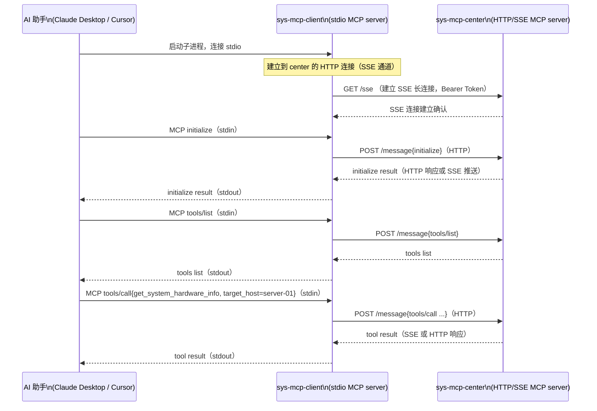
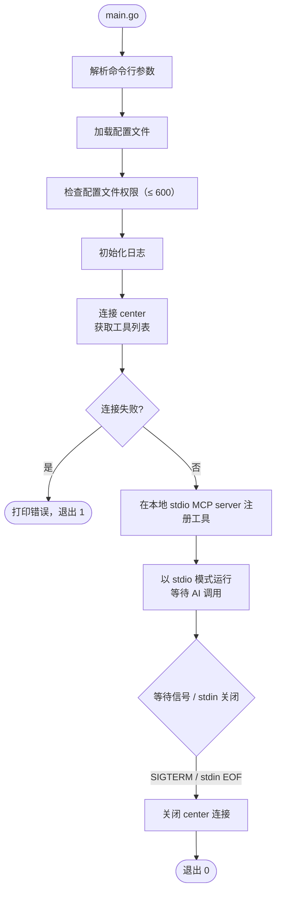

# sys-mcp-client 详细设计

## 目录

1. [职责与边界](#一职责与边界)
2. [目录结构](#二目录结构)
3. [配置设计](#三配置设计)
4. [工作原理](#四工作原理)
5. [实现细节](#五实现细节)
6. [启动与关闭流程](#六启动与关闭流程)
7. [测试策略](#七测试策略)

---

## 一、职责与边界

sys-mcp-client 是运行在用户本地的轻量进程，职责：

- 以 stdio 模式实现 MCP 协议，兼容 Claude Desktop、Cursor 等只支持 stdio 的 MCP 客户端
- 连接 sys-mcp-center（HTTP + TLS + Bearer Token）
- 从 AI 助手读取 MCP 请求（stdin），转发给 center，将响应写回 AI 助手（stdout）

因为逻辑较薄，sys-mcp-client 的代码直接放在 `cmd/sys-mcp-client/main.go` 中，无独立 `internal/sys-mcp-client/` 目录。如果后续逻辑增多（如本地缓存、多 center 路由），再拆出。

不在 client 职责范围内：
- 不执行任何系统操作
- 不缓存工具调用结果
- 不了解工具的业务语义（完全透传）

---

## 二、目录结构

```
cmd/sys-mcp-client/
└── main.go   # 全部逻辑（配置加载、MCP stdio server、HTTP 转发）
```

如果 `main.go` 超过 300 行，抽出以下子文件：

```
cmd/sys-mcp-client/
├── main.go
├── config.go   # 配置加载
└── forward.go  # HTTP 转发逻辑
```

---

## 三、配置设计

```go
// cmd/sys-mcp-client/main.go（或 config.go）

type ClientConfig struct {
    Center  CenterConfig  `yaml:"center"`
    Logging LoggingConfig `yaml:"logging"`
}

type CenterConfig struct {
    Address string `yaml:"address"`       // 如 "https://center.example.com:8443"
    Token   string `yaml:"token"`         // Bearer Token
    TLS     TLSConfig `yaml:"tls"`        // 可选，自定义 CA 证书（自签名时需要）
    TimeoutSec int `yaml:"timeout_sec"`   // 单次请求超时，默认 60
}

type TLSConfig struct {
    CAFile             string `yaml:"ca_file"`              // 自定义 CA
    InsecureSkipVerify bool   `yaml:"insecure_skip_verify"` // 仅开发环境使用
}

type LoggingConfig struct {
    Level   string `yaml:"level"`    // debug/info/warn/error
    LogFile string `yaml:"log_file"` // 空则输出到 stderr
}
```

配置文件默认路径（按优先级）：
1. `--config` 命令行参数
2. `~/.config/sys-mcp-client/config.yaml`

配置文件权限应为 `600`（client 启动时检查，若权限过宽则打印警告）。

---

## 四、工作原理



核心原理：sys-mcp-client 利用官方 MCP Go SDK 同时作为 stdio 服务端和 HTTP 客户端：
- 对 AI 助手：作为 MCP stdio server（AI 把 client 当成本地 MCP 服务）
- 对 center：作为 MCP HTTP/SSE client（client 把 center 当成远程 MCP 服务）

收到 AI 的 MCP 请求后，直接通过 MCP SDK 的 client 转发给 center，响应透传回 AI。

---

## 五、实现细节

### 5.1 使用 MCP SDK 的 Client 模式

```go
// cmd/sys-mcp-client/main.go

func run(ctx context.Context, cfg *ClientConfig) error {
    // 1. 创建到 center 的 MCP 客户端（HTTP/SSE transport）
    centerClient, err := mcp.NewClient(
        &mcp.Implementation{Name: "sys-mcp-client", Version: version.Version},
        &mcp.HTTPClientTransport{
            BaseURL: cfg.Center.Address,
            Header:  http.Header{"Authorization": {"Bearer " + cfg.Center.Token}},
            TLSConfig: buildTLSConfig(cfg.Center.TLS),
        },
    )
    if err != nil { return err }

    // 2. 从 center 获取工具列表
    toolsResult, err := centerClient.ListTools(ctx, nil)
    if err != nil { return fmt.Errorf("connect to center: %w", err) }

    // 3. 创建本地 stdio MCP 服务，将工具列表透明注册
    localServer := mcp.NewServer(
        &mcp.Implementation{Name: "sys-mcp-client", Version: version.Version},
        nil,
    )
    for _, tool := range toolsResult.Tools {
        tool := tool
        mcp.AddTool(localServer, &tool, makeForwardHandler(centerClient, tool.Name))
    }

    // 4. 以 stdio 模式运行本地服务
    return localServer.Run(ctx, mcp.NewStdioTransport())
}

func makeForwardHandler(client *mcp.Client, toolName string) mcp.ToolHandlerFunc {
    return func(ctx context.Context, req *mcp.CallToolRequest) (*mcp.CallToolResult, error) {
        return client.CallTool(ctx, req)
    }
}
```

这种设计极为精简：client 本身不需要了解任何工具的参数结构，完全透传。

### 5.2 与 Claude Desktop 集成

在 Claude Desktop 配置文件（`~/Library/Application Support/Claude/claude_desktop_config.json`）中添加：

```json
{
  "mcpServers": {
    "sys-mcp": {
      "command": "/usr/local/bin/sys-mcp-client",
      "args": ["--config", "~/.config/sys-mcp-client/config.yaml"]
    }
  }
}
```

### 5.3 错误处理

- center 连接失败：打印清晰错误信息到 stderr，退出码 1（AI 助手会看到工具列表为空）
- center Token 验证失败：打印 `authentication failed: check your token in config` 到 stderr
- 工具调用超时：MCP SDK 会将错误返回给 AI，AI 可重试

---

## 六、启动与关闭流程



client 是随 AI 助手进程启动/关闭的短生命周期进程，不需要复杂的优雅关闭逻辑：AI 关闭时 stdin 会 EOF，client 检测到后退出。

---

## 七、测试策略

因为 client 逻辑极薄（主要是粘合层），测试重点：

| 测试类型 | 覆盖范围                                      | 工具                   |
| -------- | --------------------------------------------- | ---------------------- |
| 单元测试 | 配置加载、权限检查、TLS 构建                   | `testing`              |
| 集成测试 | mock center HTTP server + stdio 管道，端到端验证转发 | `os.Pipe` + `httptest` |

关键测试用例：
- `TestConfigLoad_PermissionWarning`：配置文件权限 644 时打印警告
- `TestForward_ToolCall`：mock center 返回结果，验证 stdio 侧收到正确响应
- `TestForward_CenterDown`：center 不可达时，client 输出明确错误并退出 1
- `TestForward_AuthFailed`：center 返回 401 时，client 输出认证错误提示
