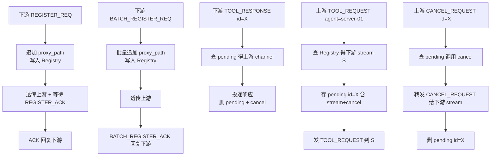
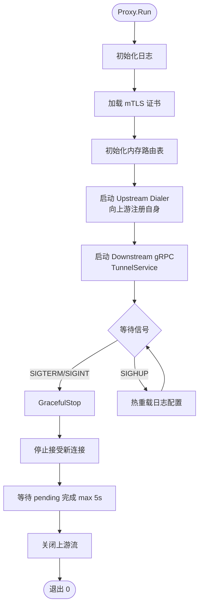

# sys-mcp-proxy 详细设计

## 目录

1. [职责与边界](#一职责与边界)
2. [目录结构](#二目录结构)
3. [配置设计](#三配置设计)
4. [模块设计](#四模块设计)
5. [连接管理](#五连接管理)
6. [消息路由](#六消息路由)
7. [多级级联](#七多级级联)
8. [启动与关闭流程](#八启动与关闭流程)
9. [测试策略](#九测试策略)

---

## 一、职责与边界

sys-mcp-proxy 是可选的连接聚合层，职责：

- 暴露与 center 完全相同的 gRPC `TunnelService` 接口，agent 无需感知上游是 proxy 还是 center
- 接收下游 agent 或下级 proxy 的注册（单个 `REGISTER_REQ` 或批量 `BATCH_REGISTER_REQ`）
- 维护本地内存路由表（hostname → 下游 stream）
- 向上游（center 或上级 proxy）建立 gRPC 长连接，将下游注册信息透传上报（包括自身）
- 转发 `TOOL_REQUEST` 到正确的下游 stream，转发 `TOOL_RESPONSE` 回上游
- 不持久化数据，所有状态保存在内存；proxy 重启后，下游会触发重连并重新注册

不在 proxy 职责范围内：
- 不解析 `ToolRequest.params_json` / `ToolResponse.result_json` 的业务内容
- 不缓存工具调用结果
- 不做业务鉴权（agent 的 token 透传给 center 验证）
- 不维护全局 agent 视图（这是 center + PostgreSQL 的职责）

proxy 对业务完全透明：只看 `TunnelMessage.type` 和 `ToolRequest.agent_hostname`。

---

## 二、目录结构

```
internal/sys-mcp-proxy/
├── config/
│   └── config.go          # ProxyConfig 结构体 + 加载逻辑
├── registry/
│   └── registry.go        # 内存路由表（hostname → DownstreamEntry）
└── tunnel/
    ├── downstream.go      # 监听下游连接，实现 TunnelService（与 center 相同接口）
    ├── upstream.go        # 管理与上游的单条长连接
    └── proxy.go           # Proxy 主结构体，Run 入口
```

---

## 三、配置设计

```go
// internal/sys-mcp-proxy/config/config.go

package config

type ProxyConfig struct {
    Hostname string         `yaml:"hostname"`  // proxy 自身的 hostname，注册到上游时使用
    Listen   ListenConfig   `yaml:"listen"`
    Upstream UpstreamConfig `yaml:"upstream"`
    Logging  LoggingConfig  `yaml:"logging"`
}

type ListenConfig struct {
    GRPCAddress string    `yaml:"grpc_address"`  // 监听下游连接，如 "0.0.0.0:9443"
    TLS         TLSConfig `yaml:"tls"`
}

type UpstreamConfig struct {
    Address              string    `yaml:"address"`
    Token                string    `yaml:"token"`
    ReconnectMaxDelaySec int       `yaml:"reconnect_max_delay_sec"`  // 默认 5
    TLS                  TLSConfig `yaml:"tls"`
}

type TLSConfig struct {
    CertFile string `yaml:"cert_file"`
    KeyFile  string `yaml:"key_file"`
    CAFile   string `yaml:"ca_file"`
}

type LoggingConfig struct {
    LogRequests bool   `yaml:"log_requests"`
    LogFile     string `yaml:"log_file"`
    Level       string `yaml:"level"`
}
```

配置文件默认路径（按优先级）：
1. `--config` 命令行参数
2. `~/.config/sys-mcp-proxy/config.yaml`
3. `/etc/sys-mcp-proxy/config.yaml`

---

## 四、模块设计

### 4.1 Proxy 主结构体

```go
// internal/sys-mcp-proxy/tunnel/proxy.go

type Proxy struct {
    cfg        *config.ProxyConfig
    registry   *registry.Registry
    downstream *Downstream  // 监听下游，实现 TunnelService（同 center 接口）
    upstream   *Upstream    // 与上游的单条长连接
}

func New(cfg *config.ProxyConfig) (*Proxy, error)

// Run 是 cmd/sys-mcp-proxy/main.go 唯一调用的入口
func (p *Proxy) Run(ctx context.Context) error
```

main.go 保持极简：

```go
// cmd/sys-mcp-proxy/main.go
func main() {
    cfg, err := config.Load()
    if err != nil {
        slog.Error("load config", "err", err)
        os.Exit(1)
    }
    p, err := proxy.New(cfg)
    if err != nil {
        slog.Error("init proxy", "err", err)
        os.Exit(1)
    }
    if err := p.Run(context.Background()); err != nil {
        slog.Error("proxy exited", "err", err)
        os.Exit(1)
    }
}
```

### 4.2 Registry（内存路由表）

```go
// internal/sys-mcp-proxy/registry/registry.go

type DownstreamEntry struct {
    Hostname   string
    IP         string
    OS         string
    ProxyPath  []string
    Stream     stream.TunnelStream
    RegisterAt time.Time
    LastHB     time.Time
}

type Registry struct {
    mu       sync.RWMutex
    entries  map[string]*DownstreamEntry
    byStream map[stream.TunnelStream][]string  // 反向索引：stream → hostnames
}

func (r *Registry) Register(entry *DownstreamEntry)
func (r *Registry) RegisterBatch(entries []*DownstreamEntry)
func (r *Registry) Unregister(hostname string)
func (r *Registry) UnregisterByStream(s stream.TunnelStream) []string
func (r *Registry) Lookup(hostname string) (*DownstreamEntry, bool)
func (r *Registry) All() []*DownstreamEntry
func (r *Registry) UpdateHeartbeat(hostname string, ts time.Time)
```

### 4.3 Downstream（下游服务端，实现 TunnelService）

proxy 实现的 `TunnelService.Connect` 与 center 相同的接口，处理逻辑：

```
收到 REGISTER_REQ:
  → 将 proxy 自身 hostname 追加到 proxy_path
  → 写入本地 Registry
  → 透传给 upstream
  → 等待 upstream 的 REGISTER_ACK，回复给下游

收到 BATCH_REGISTER_REQ:
  → 批量追加 proxy_path，写入 Registry
  → 透传给 upstream（同样用 BATCH_REGISTER_REQ）
  → 等待 upstream 的 BATCH_REGISTER_ACK，回复给下游

收到 HEARTBEAT:
  → 更新 Registry 中 LastHB
  → 透传给 upstream

收到 TOOL_RESPONSE:
  → 根据 request_id 查 pending 得到上游等待 channel
  → 投递响应，清理 pending（触发 defer cancel()）

收到 CANCEL_REQUEST:
  → 查 pending[request_id]，调用 cancel() 终止等待
  → 转发 CANCEL_REQUEST 给对应下游 stream
  → 删除 pending[request_id]
```

### 4.4 Upstream（上游客户端）

```go
// internal/sys-mcp-proxy/tunnel/upstream.go

type Upstream struct {
    cfg      *config.UpstreamConfig
    hostname string
    dialer   *stream.Dialer

    // pending: request_id → 下游 stream（用于将响应路由回正确下游）
    pending sync.Map
}
```

收到上游消息的处理：

```
收到 TOOL_REQUEST(agent_hostname=server-01):
  → 查 Registry 得下游 stream S
  → 存 pending[request_id] = {stream: S, cancel: cancelFn}（带超时 context，超时后自动清理）
  → 发 TOOL_REQUEST 到 S

收到 REGISTER_ACK(hostname=server-01):
  → 根据 request_id 找注册等待槽
  → 转发 ACK 给对应下游 stream

收到 HEARTBEAT_ACK(agent_hostname=server-01):
  → 用 HeartbeatAck.agent_hostname 查 Registry 得下游 stream
  → 转发 HEARTBEAT_ACK 给该 stream（多 agent 并发心跳时通过 hostname 正确路由）

收到 CANCEL_REQUEST(request_id=X):
  → 查 pending[X]，调用 cancelFn() 终止下游等待
  → 转发 CANCEL_REQUEST 给对应下游 stream
  → 删除 pending[X]
```

pending 槽的生命周期管理（防内存/goroutine 泄漏）：

```go
// Upstream.RouteRequest 伪代码
func (u *Upstream) RouteRequest(downStream TunnelStream, req *tunnel.ToolRequest) {
    reqID := req.RequestId
    ctx, cancel := context.WithTimeout(context.Background(), u.cfg.RequestTimeoutSec)
    ch := make(chan *tunnel.ToolResponse, 1)
    u.pending.Store(reqID, &pendingEntry{ch: ch, cancel: cancel})
    defer func() {
        cancel()
        u.pending.Delete(reqID)
    }()

    if err := u.dialer.Send(buildToolReq(reqID, req)); err != nil {
        downStream.Send(buildError(reqID, "PROXY_UPSTREAM_LOST"))
        return
    }

    select {
    case resp := <-ch:
        downStream.Send(buildToolResp(reqID, resp))
    case <-ctx.Done():
        downStream.Send(buildError(reqID, "PROXY_UPSTREAM_TIMEOUT"))
    }
}
```

---

## 五、连接管理

### 5.1 上游连接（proxy 自身注册）

proxy 启动后向上游发送自身的 `RegisterRequest`（`proxy_path=[]`），让上游知道这是一个 proxy 节点。之后才开始透传下游 agent 的注册信息。

上游断线重连后：
1. 重新发送 proxy 自身的 `RegisterRequest`
2. 通过一条 `BATCH_REGISTER_REQ` 将 Registry 中所有 agent 批量补注册到上游
3. 补注册期间，新来的下游注册请求正常入 Registry 并加入待发队列

重连最大延迟：**5s**（可配置）。

### 5.2 下游连接断线处理

stream 断开时：
1. `Registry.UnregisterByStream()` 批量获取失效 hostname 列表
2. 无需主动通知上游——上游的心跳超时机制会自动将这些 agent 标记为 offline

### 5.3 并发安全

- Registry 使用 `sync.RWMutex` + `byStream` 反向索引
- pending 使用 `sync.Map`
- 所有 stream 操作在独立 goroutine 中执行，通过 context 传递取消信号

---

## 六、消息路由



---

## 七、多级级联

proxy 的上游地址可指向另一个 proxy，实现多级级联。`proxy_path` 逐层追加：

```
agent-A → proxy-idc-a → proxy-region-north → center

注册流:
  agent-A:            RegisterRequest{proxy_path=[]}
  proxy-idc-a:        追加后 {proxy_path=["proxy-idc-a"]}
                      → 发给 proxy-region-north
  proxy-region-north: 追加后 {proxy_path=["proxy-idc-a","proxy-region-north"]}
                      → 发给 center
  center:             记录 AgentRecord{ProxyPath=["proxy-idc-a","proxy-region-north"]}
```

center 路由请求时找 `ProxyPath` 最末的 proxy stream 下发，中间各级 proxy 再按本地 Registry 逐级转发。

---

## 八、启动与关闭流程

`cmd/sys-mcp-proxy/main.go` 只负责加载配置、调用 `proxy.Run()`，所有启动逻辑在 `internal/sys-mcp-proxy/` 中：



---

## 九、测试策略

| 测试类型 | 覆盖范围                                           | 工具                  |
| -------- | -------------------------------------------------- | --------------------- |
| 单元测试 | Registry CRUD、UnregisterByStream、proxy_path 追加 | `testing` + `testify` |
| 集成测试 | 完整的 agent→proxy→center 注册和请求转发           | 内存 gRPC server      |
| 故障测试 | 上游断线重连后批量补注册、下游断线后路由表清理     | 模拟 stream 关闭      |

关键测试用例：
- `TestRegistry_BatchRegister`：`BATCH_REGISTER_REQ` 正确写入所有 agent
- `TestRegistry_UnregisterByStream`：stream 断开后关联的所有 agent 均被注销
- `TestUpstream_Reconnect_BatchReregister`：重连后通过单条 `BATCH_REGISTER_REQ` 补注册全部 agent
- `TestProxy_RouteRequest`：`TOOL_REQUEST` 正确路由到目标 agent stream
- `TestProxy_ProxyPathAppend`：经过两级 proxy 后 `proxy_path` 包含正确顺序
- `TestProxy_PendingCleanup`：stream 关闭后 pending 槽被清理
